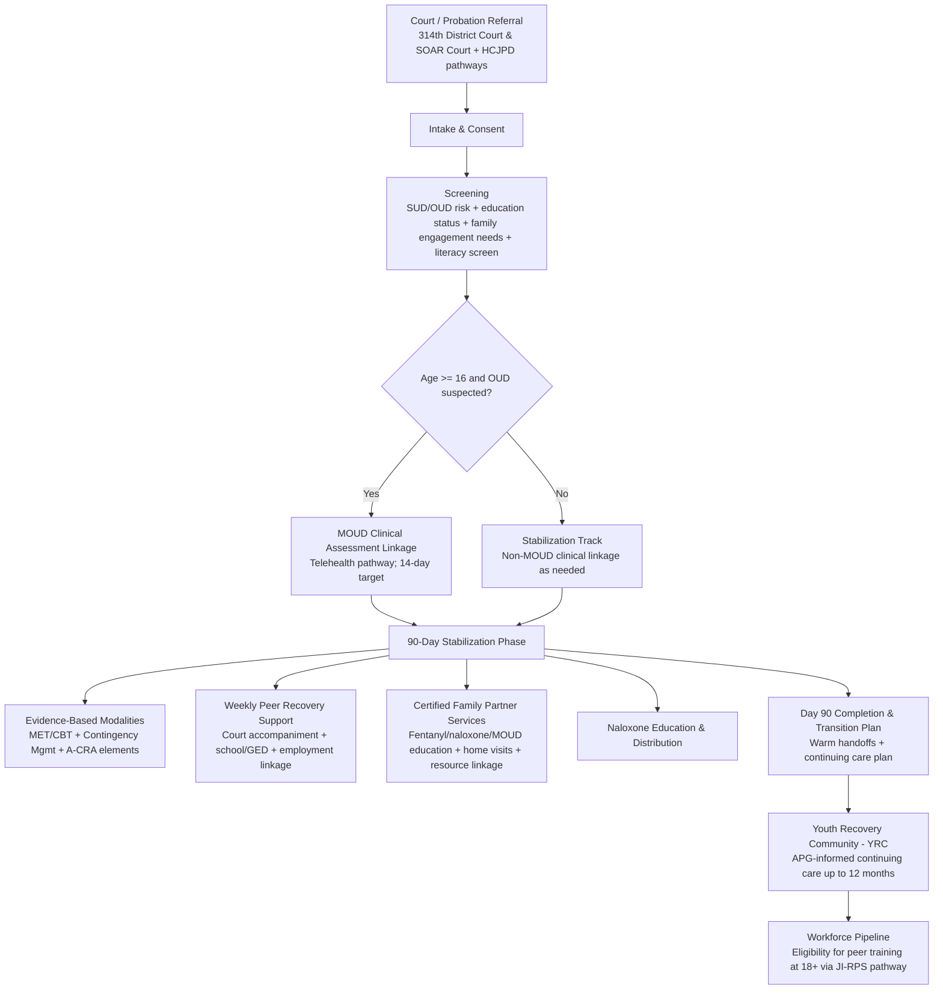
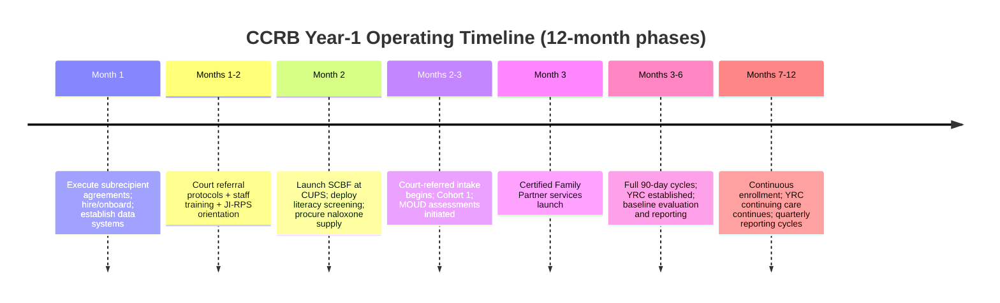

# CCRB Program Spine

## Program Identity

| Field | Value |
|---|---|
| **Program** | Court-Connected Recovery Bridge (CCRB) |
| **OAFC Strategy** | I04 - Address the Needs of Criminal Justice-Involved Persons |
| **Target Population** | Transitional Age Youth ages 12-24 with OUD/SUD, justice-involved via Harris County juvenile/young adult courts (including 314th District Court/SOAR Court) and juvenile probation referral pathways |
| **Geography** | RHP Region 3 (Harris County as anchor; Region 3 is a 9-county design in the OAFC narrative) |
| **Core Model** | Court-connected 90-day stabilization + 12-month continuing care via Youth Recovery Community (YRC) |

## Referral and Intercept Logic

CCRB operates across Intercepts 2/3 and 4 of the Texas Youth Sequential Intercept Model (Youth SIM), connecting court/probation identification to community recovery infrastructure.

## Core Components

Regardless of funder, CCRB delivers:

- Standardized multi-domain intake + screening, including universal literacy screening (WRAT-5 or TABE noted in OAFC materials)
- Evidence-based modalities delivered in the stabilization phase: MET/CBT, contingency management, and A-CRA elements
- MOUD linkage via telehealth clinical assessment pathway (14-day MOUD assessment target for eligible youth ages 16+)
- Naloxone education + distribution to youth/family (OAFC package targets 150+ naloxone kits annually)
- Certified Family Partner navigation (parent education on fentanyl/naloxone/MOUD; home visits; linkage to court/community supports)
- Low-literacy curriculum delivery and accessible materials
- Court accompaniment and school/GED reentry supports; employment linkage; housing navigation for 18+
- Transition to APG-informed Youth Recovery Community (YRC) continuing care (weekly > biweekly > monthly cadence)
- Workforce pipeline: eligibility for peer specialist / JI-RPS training at age 18+ (Via Hope JI-RPS license held by CMU referenced)

## Organizational Roles (Consortium Model)

| Organization | Role |
|---|---|
| **Grace Solutions International (GSI)** | Prime applicant/fiscal agent; compliance/financial management; supports SCBF curriculum delivery through existing juvenile probation infrastructure; subrecipient agreements and monitoring |
| **Credible Messengers United (CMU)** | Program operations + credible messenger peer services; data/evaluation coordination; YRC operations; literacy screening implementation; JI-RPS training delivery |
| **Strategic Recovery Solutions (SRS)** | MOUD/telehealth linkage navigation; Certified Family Partner family services; naloxone distribution support; A-CRA elements |
| **UTHealth Houston** | External evaluation partner |

## 90-Day Stabilization Workflow

| Phase | Activities |
|---|---|
| **Days 1-7** | Intake + assessment; SUD/OUD risk; education status; family engagement assessment; MOUD referral for eligible youth (16+) |
| **Days 8-30** | Weekly peer contact; individualized plan; school/GED coordination; parent education; SCBF curriculum touchpoint; naloxone distribution |
| **Days 31-60** | Deepen pro-social supports; vocational exploration; parent groups/home visits; 30-day milestone assessment; MOUD adherence monitoring |
| **Days 61-90** | Transition planning; 90-day completion assessment; warm handoffs to ongoing community supports; post-stabilization plan |

## Continuing Care

Months 4-15: Youth Recovery Community (APG-informed) continuing care for up to 12 months post-stabilization.

## CCRB Workflow Diagram

## Year 1 Implementation Milestones

## Outcome Targets (from OAFC Materials)

| Metric | Target |
|---|---|
| Clinical assessment within 14 days | 85% |
| Evidence-based treatment initiation | 75% |
| 90-day stabilization completion | 70% |
| 12-month YRC engagement | 50% |
| Naloxone kits distributed annually | 150+ |
| Literacy gains and school/GED reentry | Tracked outputs (instrument TBD) |
